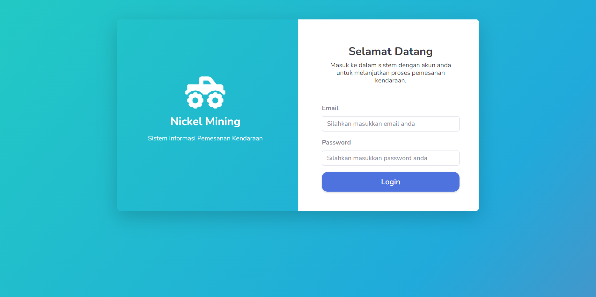
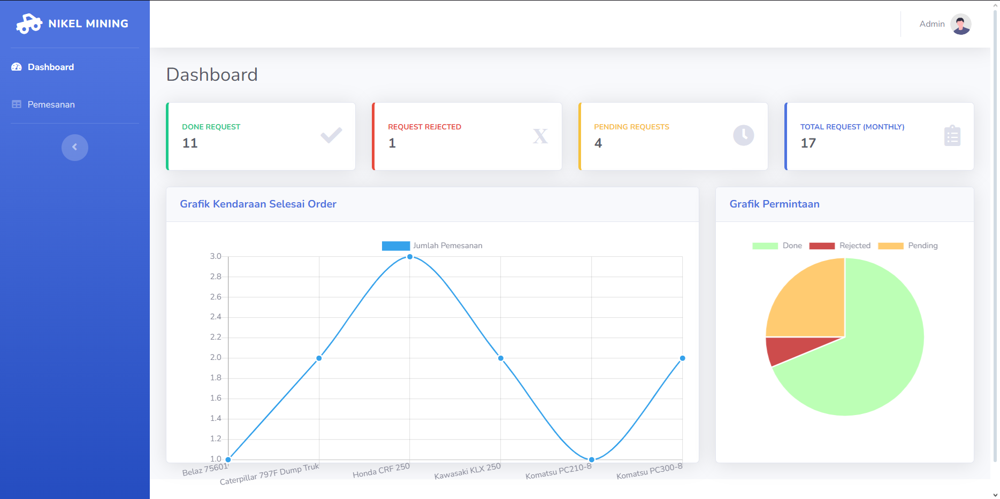
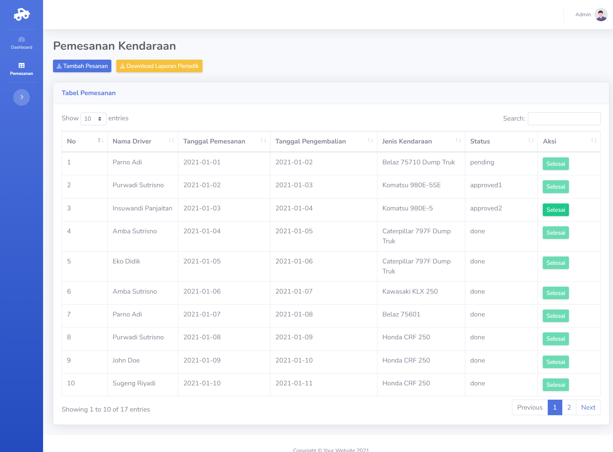
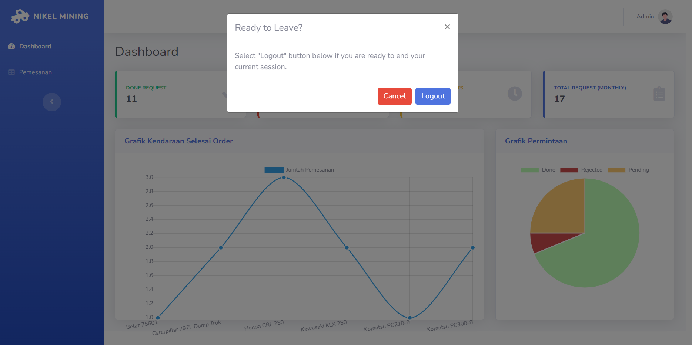
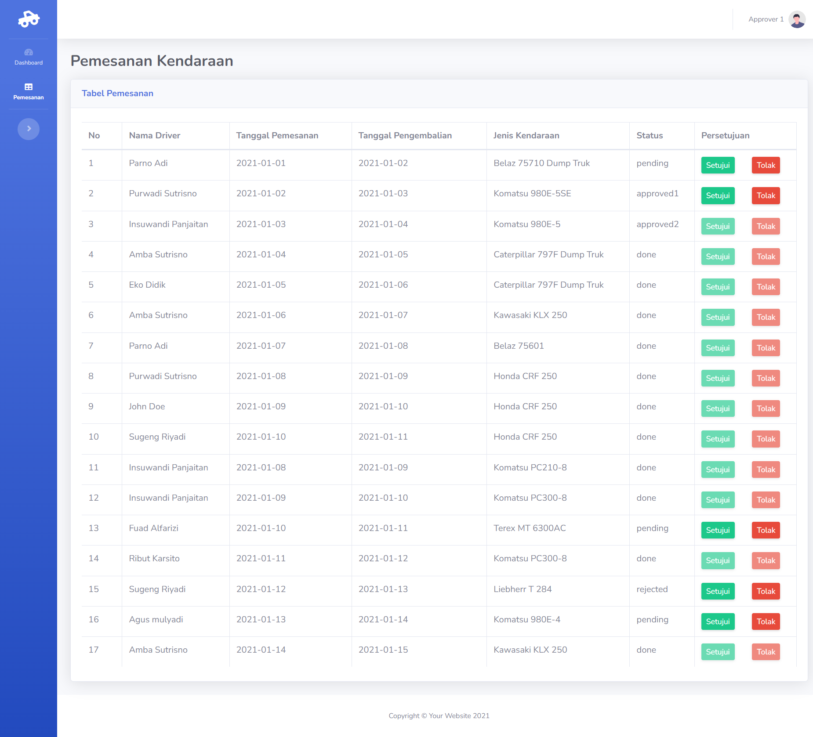
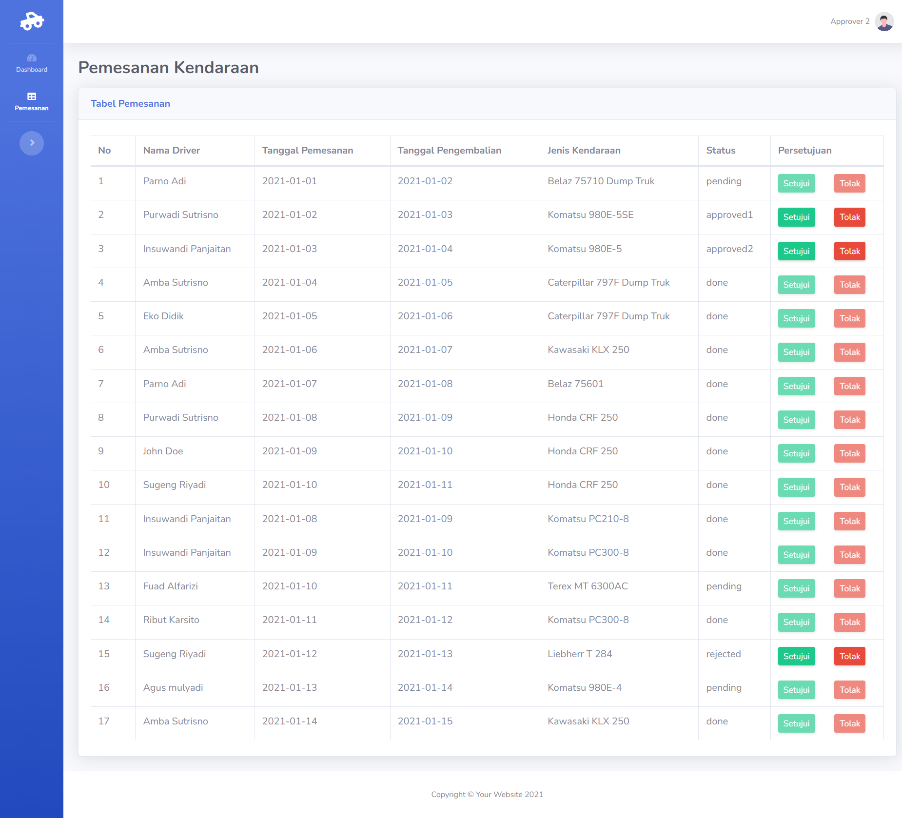

<h1 align="center" style="font-size:2rem;">Nickel Mining</h1>

 Aplikasi Pemesanan Kendaraan Perusahaan Tambang Nikel
      

## 📝 Table of Contents

-   [About The Project](#about)
-   [Fitur Aplikasi](#fitur)
-   [Cara Menggunakan](#usage)
-   [Panduan Penggunaan Aplikasi](#panduan)
-   [Tools Version](#tools-version)
-   [Related Project](#related-project)

## 🧐 About The Project

Sebuah web aplikasi untuk monitoring kendaraan yang dimiliki oleh perusahaan. Untuk dapat memakai kendaraan, pegawai harus melakukan pemesanan terlebih dahulu ke bagian pengelola kendaraan dan pemakaian kendaraan harus diketahui atau disetujui oleh masing - masing atasan.

## 🛠 **Fitur Aplikasi** 

-   Login
-   Monitoring Grafik Pemakaian Kendaraan
-   Pemesanan Kendaraan
-   Persetujuan Pemesanan Kendaraan
-   Export laporan periodik pemesanan kendaraan dalam bentuk Excel
-   Log Aktivitas Pemesanan Kendaraan

## 🎈 Cara Menjalankan 

**1. Clone repository ini `git clone https://github.com/Maisho20/sekawanmedia-technical-test.git`**

**2. Pindah ke direktori folder project**

**3. Jalankan perintah `composer install` atau `composer update` untuk mendapatkan semua dependensi dari project**

**5. Copy file `.env.example` dan paste di file baru bernama `.env`**

**6. Generate `APP_KEY` baru dengan menjalankan command `php artisan key:generate` di terminal**

**7. Pastikan nama database di file `.env` yang bernama `DB_DATABASE` sama dengan keinginan anda**

**8. Jalankan command `php artisan migrate` untuk membuat database pada MySQL serta `php artisan migrate:fresh --seed` untuk mengisi database yang telah dibuat dengan seeder yang telah disediakan**

**9. Jalankan command `php artisan serve` untuk menjalankan project**

  

<b>Selamat Menikmati</b>

 

## 📸 **Pandan Penggunaan Aplikasi** 

#### 1. Login

</img>

> Tampilan login digunakan pengguna untuk masuk ke akun dengan memasukkan email dan password yang telah didaftarkan.

**ADMIN ACCOUNT**

admin dapat membuat pemesanan kendaraan dan melakukan konfirmasi selesai pemesanan kendaraan serta dapat melihat dan melakukan eksport laporan pemesanan kendaraan.

-   `admin@gmail.com`
-   `admin`

**APPROVER 1 ACCOUNT**

Approver1 dapat melakukan persetujuan dan penolakan pemesanan kendaraan yang telah dilakukan oleh Admin.

-   `approver1@gmail.com`
-   `pas123`

**APPROVER 2 ACCOUNT**

Approver2 dapat melakukan persetujuan dan penolakan pemesanan kendaraan yang telah dilakukan oleh Admin.

-   `approver2@gmail.com`
-   `pas321`

 

#### 2. Dashboard

</img>

> Pada halaman dashboard ini, admin dapat melihat grafik pemakaian kendaraan yang telah disediakan oleh perusahaan. Grafik ini menampilkan jumlah pemakaian kendaraan per bulan. Admin juga dapat melihat jumlah pemesanan kendaraan yang belum disetujui dan pemesanan yang ditolak.
>  

#### 3. Daftar Pemesanan Kendaraan - Admin

</img>

> -   Admin dapat melihat daftar pemesanan kendaraan yang telah dibuat.
> -   Admin dapat melakukan pencarian pemesanan kendaraan berdasarkan tanggal pemesanan, nama pegawai, dan status pemesanan.
> -   Admin dapat melakukan konfirmasi pemesanan kendaraan yang telah selesai.
> -   Admin dapat menambahkan pemesanan kendaraan baru.
> -   Admin dapat mengunduh laporan pemesanan kendaraan dalam bentuk Excel.

 

#### 4. Confirm logout

</img>

> Semua user sebelum logout akan ditanya, apakah ingin logout atau tidak. jika ya, tekan tombol `Logout`.

#### 5. Persetujuan Pemesanan Kendaraan - Approver 1

</img>

> Approver 1 dapat melihat daftar pemesanan kendaraan yang telah dibuat. Approver 1 hanya dapat menyetujui pemesanan kendaraan dengan status pending. Approver 1 tidak dapat menyetujui pemesanan kendaraan yang telah disetujui oleh Approver 2. Approver 1 juga dapat menolak pemesanan kendaraan yang telah dibuat.

 

#### 6. Persetujuan Pemesanan Kendaraan - Approver 2

</img>

> Approver 2 dapat melihat daftar pemesanan kendaraan yang telah dibuat. Approver 2 hanya dapat menyetujui pemesanan kendaraan dengan status approved1. Approver 2 tidak dapat menyetujui pemesanan kendaraan dengan status pending dan rejected. Approver 2 juga dapat menolak pemesanan kendaraan yang telah dibuat.

## Tools Version 

| Tools    | Version  |
| -------- | -------- |
| MySQL    | 10.4.32  |
| PHP      | 8.2.12   |
| Composer | 2.6.5    |
| Laravel  | 10.48.12 |

## Related Project 

-   [Physical Data Model](public/PDM/pdm.md)
-   [Activity Diagram](public/Activity-Diagram/activity.md)
