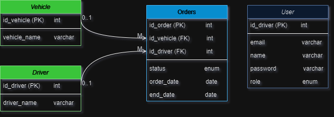
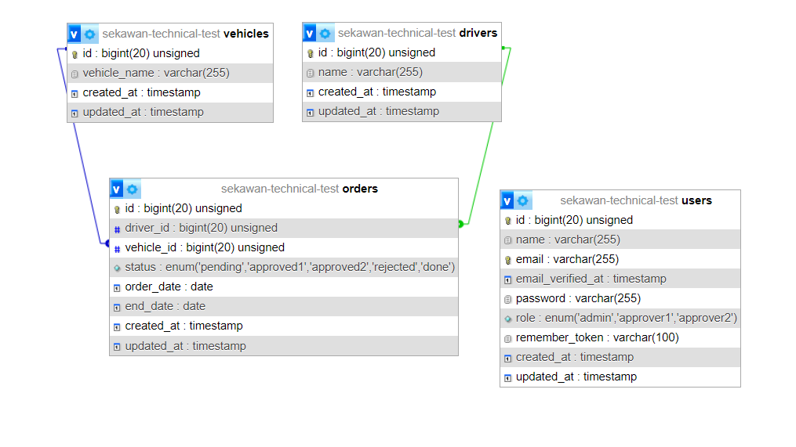

        
        <b>Make with draw.io</b>

        
        <b>Screen Shoot from PHPmyAdmin</b>

<h1 align="center" style="font-size:2rem;">Physical Data Model</h1>

 

## Database Tables

1. **Users**

    - id (Primary Key) 🔑
    - name
    - email
    - password
    - role (admin, approver1, approver2)

2. **Drivers**

    - id (Primary Key) 🔑
    - name

3. **Vehicles**
    - id (Primary Key) 🔑
    - vehicle_name
4. **Orders**

    - id (Primary Key) 🔑
    - driver_id (Foreign Key ke Drivers)
    - vehicle_id (Foreign Key ke Vehicles)
    - status (pending, approved1, approved2, rejected, done)
    - order_date
    - end_date

 

### 🔗 Database Relations

1. **Drivers - Orders**

    - Relasi One-to-Many: Seorang driver dapat terkait dengan banyak pesanan, tetapi setiap pesanan hanya dapat terkait dengan satu driver.

2. **Vehicles - Orders**
    - Relasi One-to-Many: Sebuah kendaraan dapat terkait dengan banyak pesanan, tetapi setiap pesanan hanya dapat terkait dengan satu kendaraan.
